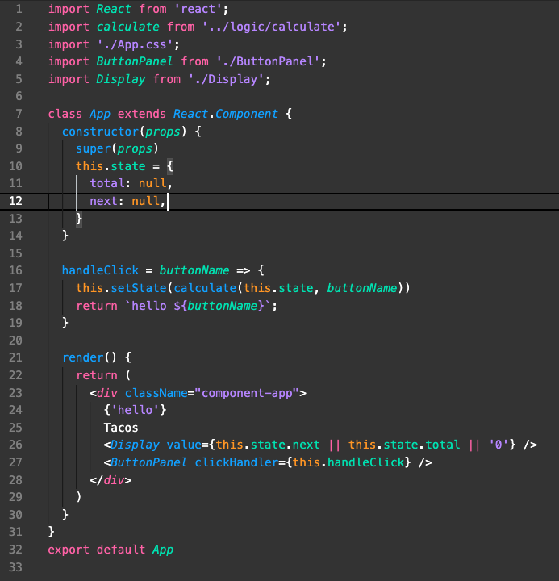
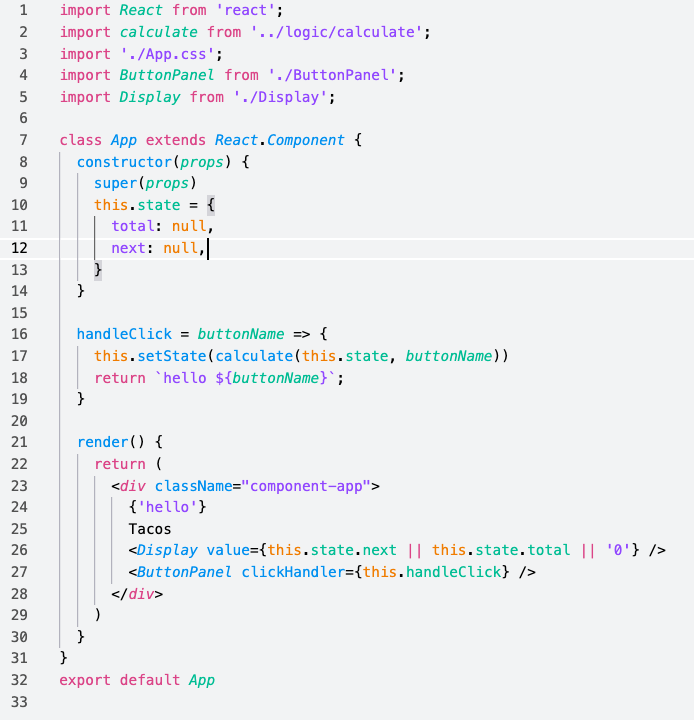

# Athena Theme

Color themes for those too picky to choose. Made for Visual Studio Code.

[![version-badge]][CHANGELOG] [![issues-badge]][issues] [![downloads-badge]][marketplace] [![license-badge]][LICENSE]

## Installation

1. Install [Visual Studio Code](https://code.visualstudio.com/).
1. Launch Visual Studio Code.
1. Go to `View` > `Extensions`.
1. Search for `Athena` by **katrinacodes**.
1. Click **Install** to install it.
1. Select a theme from `File` > `Preferences` > `Color Theme`.
1. Yay! You're all set. 🎉

## Contribute

[Issues]([issues]) and [pull requests]([pull-requests]) are welcome!

### Language Support

#### Below is a list of extensions currently supported from the `/demo` folder.

- _If not listed:_ Open a [pull request]([pull-requests]) adding a demo file to the `/demo` folder, or open an [issue]([issues]) and attach the demo file.
- _If listed:_ Open a [pull request]([pull-requests]) or [issue]([issues]) referencing the line number the problem is on, if possible.
  - `cc`
  - `clj`
  - `cljs`
  - `css`
  - `elm`
  - `h`
  - `html`
  - `js`
  - `json`
  - `jsx`
  - `md`
  - `php`
  - `ps1`
  - `pug`
  - `py`
  - `rb`
  - `tsx`
  - `vue`
  - `yml`

[CHANGELOG]: ./CHANGELOG.md
[LICENSE]: ./LICENSE
[issues]: https://github.com/GreeKatrina/Athena/issues
[marketplace]: https://marketplace.visualstudio.com/itemdetails?itemName=katrinacodes.athena
[pull-requests]: https://github.com/GreeKatrina/Athena/pulls

[downloads-badge]: https://img.shields.io/visual-studio-marketplace/d/katrinacodes.athena.svg
[issues-badge]: https://img.shields.io/github/issues-raw/GreeKatrina/Athena.svg
[license-badge]: https://img.shields.io/github/license/GreeKatrina/Athena.svg
[version-badge]: https://vsmarketplacebadge.apphb.com/version/katrinacodes.athena.svg